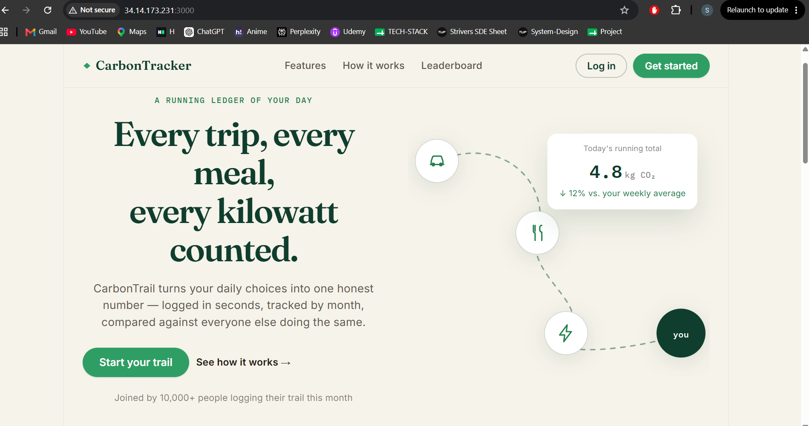
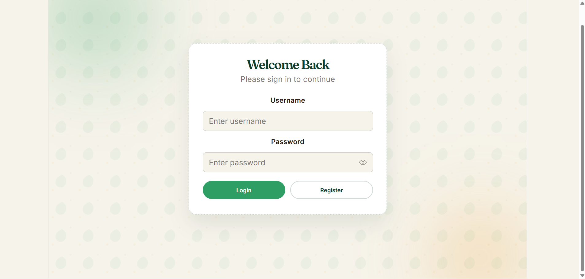
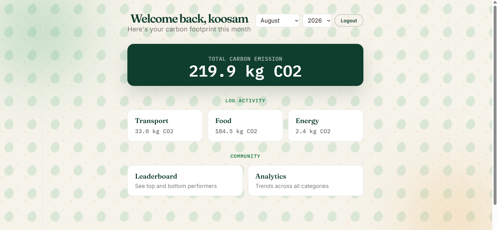
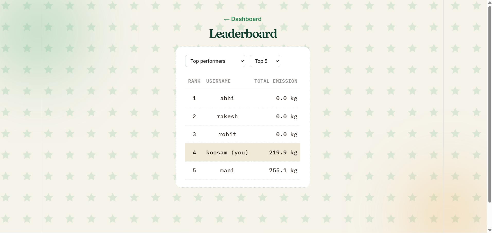

# 🌱 Carbon Footprint Tracker

> A full-stack microservices application for tracking, analyzing, and
> comparing personal carbon emissions.

## 📌 Overview

Carbon Footprint Tracker helps users track their carbon emissions from
three major areas:

- 🚗 Transportation
- ⚡ Energy consumption
- 🍽️ Food consumption

The application calculates monthly carbon footprints and provides
analytics and a leaderboard to compare users.

The backend is built using Spring Boot microservices, with Eureka for
service discovery, Spring Cloud Gateway for centralized API routing,
and OpenFeign for service-to-service communication.

The frontend is built using React and Vite.

The application is containerized with Docker and Docker Compose, with
CI/CD implemented using Jenkins, GitHub Webhooks, Docker Hub, and
Google Cloud Platform.

---

## ✨ Features

- User registration and login
- JWT-based authentication
- Track transportation emissions
- Track energy consumption
- Track food consumption
- Monthly carbon footprint calculation
- Carbon footprint analytics
- Global user leaderboard
- Microservices-based architecture
- Service discovery using Eureka
- API routing using Spring Cloud Gateway
- Service-to-service communication using OpenFeign
- Dockerized application
- Automated CI/CD pipeline
- GCP-based deployment

## 🏗️ Architecture

                         User
                           │
                           ▼
                    React + Vite
                           │
                           ▼
                    API Gateway
                           │
          ┌────────────────┼────────────────┐
          │                │                │
          ▼                ▼                ▼
      Auth Service    Transport Service   Energy Service
                           │                │
                           └───────┬────────┘
                                   │
                              Food Service
                                   │
                                   ▼
                           Analytics Service
                                   │
                                   ▼
                           Leaderboard Service

                    Eureka Service Registry
                              │
                    Service Discovery

                              │
                              ▼
                            MySQL

## Deployment              

GitHub
   │
   │ Webhook
   ▼
Jenkins VM
   │
   │ Docker Build & Push
   ▼
Docker Hub
   │
   │ Pull
   ▼
GCP Application VM
   │
   └── Docker Compose
        ├── Frontend
        ├── API Gateway
        ├── Backend Services
        ├── Eureka
        └── MySQL

## 🛠️ Tech Stack

| Category              | Technologies                          |
| --------------------- | ------------------------------------- |
| Frontend              | React, Vite, Axios                    |
| Backend               | Java 21, Spring Boot 3.5.6            |
| Security              | Spring Security, JWT                  |
| Database              | MySQL                                 |
| Service Discovery     | Spring Cloud Eureka                   |
| API Gateway           | Spring Cloud Gateway                  |
| Service Communication | OpenFeign                             |
| Build                 | Maven                                 |
| Testing               | JUnit, Mockito                        |
| Containerization      | Docker, Docker Compose, Docker Buildx |
| CI/CD                 | Jenkins, GitHub Webhooks              |
| Container Registry    | Docker Hub                            |
| Cloud                 | Google Cloud Platform, Compute Engine |
| Web Server            | Nginx                                 |

## 🔧 Microservices

| Service             | Responsibility                             |
| ------------------- | ------------------------------------------ |
| Service Registry    | Service discovery using Eureka             |
| API Gateway         | Central entry point for backend APIs       |
| Auth Service        | Registration, login and JWT authentication |
| Transport Service   | Transportation data and emissions          |
| Energy Service      | Energy consumption and emissions           |
| Food Service        | Food consumption and emissions             |
| Analytics Service   | Monthly carbon footprint calculation       |
| Leaderboard Service | User ranking based on carbon footprint     |
| Frontend            | React/Vite user interface                  |

## 🚀 Getting Started

### Prerequisites

Make sure the following are installed:

- Java 21
- Maven
- Node.js
- npm
- Docker
- Docker Compose
- Git

### Clone the Repository

git clone https://github.com/shashidhar1900/carbon-footprint-tracker.git
cd carbon-footprint-tracker
Run with Docker Compose

From the project root:

docker compose up -d

Check running containers:

docker compose ps

To stop the application:

docker compose down

## 🐳 Docker

The application is containerized into separate Docker containers for
each microservice, frontend, Eureka service registry, and MySQL.

Docker Compose creates a shared network:

carbon-net

This allows the containers to communicate using service names.

The application uses a persistent Docker volume for MySQL:

mysql_data

## 🔄 CI/CD

The project uses Jenkins to automate the build and deployment process.

Git Push
   ↓
GitHub Webhook
   ↓
Jenkins
   ↓
Docker Buildx
   ↓
Docker Hub
   ↓
SSH
   ↓
GCP Application VM
   ↓
Docker Compose

>Pipeline
1.Developer pushes changes to the development branch.
2.GitHub triggers Jenkins through a webhook.
3.Jenkins checks out the source code.
4.Jenkins builds Docker images for all services.
5.Images are tagged with the Jenkins build number and latest.
6.Images are pushed to Docker Hub.
7.Jenkins connects to the Application VM using SSH.
8.Application VM pulls the latest images.
9.Docker Compose starts/updates the application.

## 📸 Screenshots

Landing page

Login

Dashboard

Leaderboard

🌐 Live Demo

Coming soon.

The application is currently deployed on Google Cloud Platform.
A permanent public domain will be added later.

📁 Project Structure
carbon-footprint-tracker/
│
├── backend/
│   ├── service-registry/
│   ├── api-gateway/
│   ├── auth-service/
│   ├── transport-service/
│   ├── energy-service/
│   ├── food-service/
│   ├── analytics-service/
│   └── leaderboard-service/
│
├── frontend/
│
├── docs/
│   └── project_documentation.md
│
├── docker-compose.yml
├── Jenkinsfile
└── README.md

## 📚 Documentation

Detailed technical documentation is available here:

docs/project_documentation.md

The documentation covers:

    System architecture
    Request and data flows
    JWT authentication
    Service-to-service communication
    Docker and deployment
    CI/CD pipeline
    Problems and solutions

## 🔮 Future Improvements
Custom domain and HTTPS
Production-grade secrets management
Monitoring and centralized logging
Automated rollback for failed deployments
Improved scalability and high availability